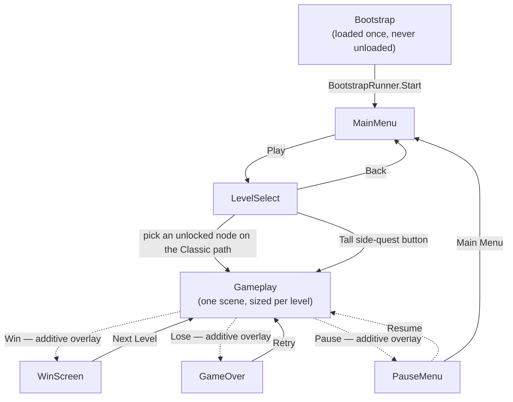
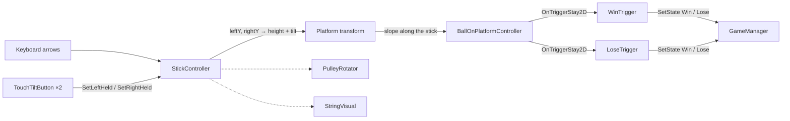

# Tilt Ball

Tilt the platform to guide the ball to the goal. Tilt Ball is a 2D physics-flavoured puzzle game: a ball sits on
a stick hung from two ropes; you raise the left or right end to tilt it, the ball rolls along it, and you climb
the stick up the screen to drop the ball into the winning hole while dodging lose holes and other obstacles.

This document is the single reference for how the project is put together — engine, scenes, mechanics, the
level system, the level-design tools, the obstacle set, the level catalogue and the responsive layout.

**Contents**

1. [Getting started](#1-getting-started)
2. [Project layout](#2-project-layout)
3. [Scenes and navigation](#3-scenes-and-navigation)
4. [Gameplay mechanics](#4-gameplay-mechanics)
5. [Obstacles and boosters](#5-obstacles-and-boosters)
6. [The level system](#6-the-level-system)
7. [Designing levels](#7-designing-levels)
8. [Level catalogue and progression](#8-level-catalogue-and-progression)
9. [Responsive layout and UI](#9-responsive-layout-and-ui)
10. [Persistence](#10-persistence)
11. [Build and release](#11-build-and-release)
12. [Ideas not built](#12-ideas-not-built)
13. [History](#13-history)

---

## 1. Getting started

| | |
|---|---|
| Engine | Unity **6000.3.12f1**, Universal Render Pipeline 17.3, new Input System 1.19, 2D physics |
| Third-party | [PrimeTween](https://github.com/KyryloKuzyk/PrimeTween) 1.3.3 (via OpenUPM) drives every animation — no `Animator`/coroutine tweening |
| Target device | iPhone 15 class — 1179×2556, aspect 0.4613. Every screen is designed at that aspect and adapts from there (§9) |
| Play in the Editor | open `Assets/Scenes/end-to-end/Bootstrap.unity` and press Play. Bootstrap hands off to the Main Menu |
| Keyboard | ← / → raise the left / right end of the stick (the on-screen buttons do the same on device) |

**A load-bearing project setting:** Enter Play Mode Options are on with **both domain reload and scene reload
disabled** (`ProjectSettings/EditorSettings.asset`, `m_EnterPlayModeOptions: 3`). Play starts fast, but
`[ExecuteAlways]` components are already awake from Edit mode, so `Awake` never runs again on Play — anything
that must happen per play session is driven from `FixedUpdate`/state instead (see `BallOnPlatformController`),
and Edit-mode tools must restore the scene *before* Play starts, not rely on a reload (see `LevelDesignPreview`).

## 2. Project layout

```
Assets/
  Scenes/end-to-end/       the 7 shipping scenes (§3) — nothing else ships
  Scripts/
    Core/                  singletons (GameManager, SceneLoader, SaveManager, AudioManager), camera fit, profile
    Gameplay/              stick, ball, holes, camera follow, cosmetic followers
    Gameplay/Obstacles/    Bumper, WindZone, Magnet, LaserGate/Beam, IcePatch, Oscillator, BallHazard
    Gameplay/Boosters/     Pickup base, JetBoost, Shield, StickBoost, BallShield
    Level/                 LevelConfig, LevelController, backgrounds, LevelDesignPreview
    UI/                    one thin controller per screen + shared UI utilities
    Input/                 TouchTiltButton
  Editor/                  LevelDesignTools (§7), ObstacleArtGenerator (§5), IOSBuildStamper (§11)
  Levels/
    Configs/               one LevelConfig .asset per level
    ObstaclePrefabs/       one layout prefab per level: the winning hole + the obstacles
    Designs/               level design scenes — workbenches, never in Build Settings
  Prefabs/                 StickRig, WinningHole, LoseHole_1…20, backgrounds, UI pieces; Obstacles/ for the set
  Config/ScreenFit/        the two ScreenFitProfile assets (§9)
  Art/                     sprites; Art/Obstacles is generated (§5)
```

## 3. Scenes and navigation

The game is **one persistent scene plus additively-swapped screens** — never a single-scene reload.



**Main scenes** — MainMenu, LevelSelect, Gameplay — are swapped in one at a time; each has its own `Main Camera`,
`EventSystem`, `Canvas` and one small controller script. **Overlays** — PauseMenu, WinScreen, GameOver — are
loaded additively *on top of* the running Gameplay scene and carry no camera of their own: WinScreen and
GameOver fade a translucent backdrop in over the still-visible level, and Gameplay is only unloaded when the
player actually leaves (Next Level, Retry, Main Menu, Level Select).

**`SceneLoader`** (in Bootstrap) is the only script allowed to call `SceneManager`. `SwapTo(name)` unloads the
current main scene and loads the next additively, so Bootstrap is never touched. Its public surface is four
calls — `GoToMainMenu`, `GoToLevelSelect`, `LoadGameplay`, `RetryLevel` — and it reacts to `GameManager`'s state
changes to show/hide the overlays and toggle `Time.timeScale` for pause. Both modes load the same `Gameplay`
scene; how tall a level plays is data (§6).

### Bootstrap singletons

`Bootstrap.unity` is first in Build Settings and holds five `Instance`-guarded singletons:

| Script | Responsibility |
|---|---|
| `GameManager` | `CurrentState` (`Playing/Win/Lose/Pause`), `CurrentMode` (`Classic/Tall`), the selected `currentLevel`, both level lists (`allLevels`, `tallLevels`), `OnStateChanged`. Holds no geometry knowledge; never touches scenes or timescale |
| `SceneLoader` | all scene transitions and the overlays (above) |
| `SaveManager` | one unlock index per mode in `PlayerPrefs` (§10) |
| `AudioManager` | one looping music source, one one-shot SFX source; menu click, win/lose hole/screen sounds, music ducking on unscaled time, persisted music/SFX toggles |
| `BootstrapRunner` | `Start()` → `SceneLoader.GoToMainMenu()` — runs after every other singleton's `Awake` |

`PerformanceSettings` runs even earlier (`[RuntimeInitializeOnLoadMethod(BeforeSceneLoad)]`): pins
`targetFrameRate = 60`, disables vSync, matches `fixedDeltaTime` to 60 Hz — iOS caps at 30 fps otherwise.

## 4. Gameplay mechanics



**`StickController`** owns the platform (a *kinematic* `Rigidbody2D`). Each end (`leftY`/`rightY`) rises at
`riseSpeed` (3.57 u/s) while held and falls at `fallSpeed` (1.62 u/s) otherwise, clamped to
`[minOffset, maxOffset]` = `[0, 10.5]` above the spawn height. Tilt is *linear* in the height difference (not
`atan2`, so the turn rate stays constant) and capped at `maxTiltAngle`. Keyboard and touch are OR'd, so both
work at once. `maxOffset` is the stick's travel range and the one number a longer level raises (§6).

**`BallOnPlatformController`** does **not** let Unity's solver handle the ball on the stick. The ball is
kinematic, ignores every platform collider, and is driven as a **1-DOF body along the stick**:
`v += slope · rollAcceleration · platformLength · dt`, exponential damping by half-life, end stops that bounce at
half speed — ported 1:1 from the HTML prototype the game came from. Physics only matters for the trigger
colliders on holes and obstacles. Everything external acts on the ball through a tiny API (§5).

**Win / Lose** are structurally identical `OnTriggerStay2D` checks: once the ball is "contained enough" they
take it over, play the same three-beat PrimeTween fall-in (pull to centre, spin, shrink), fire the hole sound, and
after a short beat report `Win`/`Lose` to `GameManager`. They differ in the containment test — `WinTrigger`
compares centre distance against the fill disc's radius (default: half in); `LoseTrigger` samples the ball's rim
against the hole's actual collider shape, since lose holes are irregular blobs (default: fully in). Both find
`StickController` and `GameManager` with `FindFirstObjectByType` when unwired, so they can be dropped into any
layout prefab.

**Cosmetic followers** (never write gameplay state): `PulleyRotator` spins the wheels with the rope speed,
`StringVisual` draws each rope as a `LineRenderer`, `HoleOutline` traces a hole's capture boundary,
`MrBallIdle` is the mascot's breathing loop.

## 5. Obstacles and boosters

### The design space

The ball can only roll along the stick and the stick can only rise, fall and tilt. The original obstacle — the
lose hole — punishes being at the wrong *x* when the stick passes a given *y*. The obstacle set widens that
along three axes:

| Axis | What the player manages | Pieces |
|---|---|---|
| **Momentum** — the ball's speed is no longer only the player's | pre-empt / counter a push | Bumper, Wind, Magnet, Ice |
| **Time** — the board changes while you climb | wait, or commit at the right moment | Laser Gate, gusting Wind, drifting hole |
| **Resources** — one-off help | route through, or around, the pickup | Jet Boost, Shield |

### The external-influence API

Every obstacle talks to the ball through four calls on `BallOnPlatformController`, so the 1-DOF simulation stays
the only thing that moves it:

| Call | Effect | Used by |
|---|---|---|
| `AddImpulse(dv)` / `SetVelocity(v)` | instant change of along-stick velocity | Bumper, Shield knock-back |
| `AddAcceleration(a)` | along-stick acceleration for the current physics step | Wind, Magnet |
| `RegisterSurface(key, accelMul, dampingMul)` / `UnregisterSurface` | scales roll acceleration and damping half-life while registered | Ice |
| `SignedOffsetAlong(point)` / `Tangent` | where a world point sits relative to the ball along the stick | anything that needs a direction |

All are ordinary trigger colliders (the ball uses `useFullKinematicContacts`).

### The pieces — `Assets/Prefabs/Obstacles/`, scripts in `Scripts/Gameplay/Obstacles|Boosters/`

- **Bumper** (`BumperObstacle`) — on contact the ball is thrown along the stick *away from the bumper's centre*
  at `kickSpeed` (4–5 u/s ≈ a stick-length before damping). Can't be rolled through, only around. Cooldown +
  squash tween.
- **Wind Zone** (`WindZone`) — a band with a fan and chevrons; inside it the ball is pushed at `strength` u/s²
  (5–7; a 10–15° counter-tilt holds position). `period > 0` makes it **gust** — on for `dutyCycle` of each
  period — turning steering into timing. `size`/`direction` re-lay the band, fan and chevrons.
- **Magnet** (`MagnetObstacle`) — a horseshoe with a pulsing ring showing its reach (its `CircleCollider2D`,
  2.0–2.2). Inside it the ball is dragged toward the magnet, strongest at the centre. Harmless alone; the danger
  is always the hole placed between the route and the magnet.
- **Laser Gate** (`LaserGate` + `LaserBeam`) — two emitters, a beam cycling `onDuration`/`offDuration`. A live
  beam kills (`BallHazard.Zap`); it **flickers for `warmUp`** before going live so a ball halfway through has a
  beat to commit. `phase` lets two gates alternate; `width` sizes the whole thing.
- **Ice Patch** (`IcePatch`) — while on it, roll acceleration ×1.5 and damping half-life ×6 (0.5 s → 3 s): the
  tiniest tilt sends the ball skating. Never kills alone; makes whatever is on or past it hard to avoid.
- **Oscillator** — slides any transform ±`travel` on a sine with `period`. On a lose hole it makes a
  **drifting hole**, the only way a hole becomes a timing obstacle.
- **Jet Boost** (`JetBoostPickup` → `StickBoost`) — 3 s of rise ×2 (3.57 → 7.14 u/s), fall ×1.3; pulleys glow,
  the ball trails sparks. A second pickup *extends* rather than stacks. The "dash" — and a way to fling yourself
  into a hole twice as fast.
- **Shield** (`ShieldPickup` → `BallShield`) — a bubble. The next thing that would end the run — hole *or*
  laser — pops it instead and throws the ball back along the stick (the hole ignores the ball for 0.6 s so it
  can get out). One hit, no stacking. The safety valve for intro levels.
- **`BallHazard`** is the non-hole death path: checks the shield first (`TryShield`), then flash-and-burst and
  `Lose` after the same beat. `LoseTrigger` calls it before swallowing.

All pickups share the `Pickup` base (idle bob, pop-and-vanish, fires once).

### Tuning reference

| Parameter | Value | Why |
|---|---|---|
| Bumper `kickSpeed` | 4 intro / 5 mixed | 4 carries ~3 units — visible, not a full-length throw |
| Wind `strength` | 6 / 7 | terminal ~4.3–5 u/s; counter-tilt 12–15°. Band *height* matters as much: a straight climb crosses 1.2 units in 0.35 s, so intro bands are taller |
| Magnet `strength` / reach | 8–9 / 2.0–2.2 | inside reach the ball settles on the magnet in ~1 s |
| Laser on/off | 1.0/1.6 → 0.9/1.0 | a straight climb crosses a beam in ~0.2 s; windows shrink with level |
| Ice multipliers | accel ×1.5, half-life ×6 | ball keeps ~80 % of its speed per second instead of ~25 % |
| Jet | rise ×2, 3 s | crosses the whole board in ~1.5 s |
| Shield knock-back | 4.5 u/s, 0.6 s grace | clears a fully-swallowing hole before it re-captures |
| Hole scales | 0.07–0.12 | chosen from measured collider bounds so every hole can actually contain the 0.44-wide ball (`LoseHole_1`/`_2` can't below 0.15 and aren't used) |

### Art

The obstacle sprites in `Assets/Art/Obstacles/` are generated, not drawn: **Tools ▸ Tilt Ball ▸ Generate
Obstacle Art** (`Assets/Editor/ObstacleArtGenerator.cs`) rasterises flat SDF shapes in the game's palette at
100 PPU, with 9-slice borders on the band/ice sheets. Re-run after changing a colour or size; every prefab
reference survives.

## 6. The level system

### One scene, many levels

`Gameplay.unity` holds only what **every** level shares — the stick rig, the two backgrounds, the camera and the
HUD — authored as exactly **one screenful**: `ScreenFitProfile.designLength` = 17.07 world units tall,
7.875 wide, centred on the `Level` root (so the box is y ∈ [−8.54, 8.54]). The stick spawns at y = −5.51 and can
climb 10.5 to a summit of 4.99; the pulleys sit at 6.2; the winning hole of a one-screen level sits at 4.0.

```
Main Camera  <CameraAspectFit, CameraClimbFollow>
Level  <LevelController>
├─ StickRig            Platform (StickController) · Ball · Pulleys · Ropes
├─ LayoutRoot          empty — the level's layout prefab is spawned here
├─ LevelBackground     the panel, tiled over the level box
└─ OutOfLevelBackground  the dimmed surround, tiled over everything else the camera can see
Canvas  <GameplayHUD>  SafeArea › HUD › PlayArea (top bar) · TouchControls
```

Everything that makes a level *that* level lives in two assets:

| Asset | Holds |
|---|---|
| `Assets/Levels/Configs/<name>.asset` (`LevelConfig`) | `layoutPrefab`, `levelLength`, `backgroundSprite` (+ unused placeholders `ballStartPosition`, `timeLimit`) |
| `Assets/Levels/ObstaclePrefabs/<name>_Obstacles.prefab` | the **layout**: the `WinningHole` and every obstacle, as nested prefab instances at absolute world positions |

plus one entry in `GameManager.allLevels` or `tallLevels` (Bootstrap). Array order is level order.

**`levelLength`** is the one number that decides how a level plays. `0` (or anything up to one screenful) is a
**Classic** level — the scene exactly as authored, camera still. Anything larger is a **Tall** level: the climb
runs several screens and the camera scrolls.

### What happens when a level loads

`LevelSelectController` (or WinScreen's Next Level) sets `GameManager.currentLevel` and calls
`SceneLoader.LoadGameplay()`. In the freshly loaded scene, `LevelController.Awake`:

1. `extra = max(levelLength, designLength) − designLength` — 0 for Classic, e.g. 24.93 for `Tall_01` (42).
2. Floor is the bottom of the authored screenful (−8.54); ceiling is `floor + length`.
3. If `extra > 0`: `stick.maxOffset += extra` and the `Pulleys` group rises by `extra`. So the pulleys always
   sit the same distance below the ceiling, and the stick can always reach them. Nothing else in the rig moves,
   and only `maxOffset` is ever written on the stick — it's re-read every `FixedUpdate`, so `Awake` order can't
   bite.
4. `CameraClimbFollow.ConfigureBounds(floor, ceiling)` — always, Classic included.
5. `Instantiate(layoutPrefab, layoutRoot)` — the hole and obstacles arrive at their designed positions.

Then in `Start`: the config's `backgroundSprite` is pushed to both backgrounds, both are fitted, and the camera
snaps to the stick.

### The camera

`CameraClimbFollow` follows **the stick, not the ball** (the ball's height swings with the tilt), with
`SmoothDamp` on unscaled time so pausing can't leave a lurch. Its clamp keeps the view inside the level —
`[floor + half, ceiling − half]`, recomputed from the camera's *current* size every frame — and **collapses to
the level's centre when the level is no taller than the view**, which is what lets one component sit on every
level: a Classic level's camera simply never moves. `Tall_01` opens at the same frame as a Classic level and
only starts scrolling once the stick climbs past it; at the top it parks and the last screenful plays like a
Classic level.

### Backgrounds

Both backgrounds are **world-space and tiled; nothing follows the camera**, so as the camera climbs the art
genuinely passes by. `TiledBackground` tiles a sprite over a world rectangle at one tile per play-area width.
`LevelBackground` (a subclass) covers exactly the level box; `OutOfLevelBackground` — the dimmed surround —
covers everything the camera can ever show beyond it (`LevelController.SurroundRect`: full view width; vertically
the level, or the view centred on a shorter level). Both take the **same sprite from `LevelConfig.backgroundSprite`**;
the prefabs' own sprite is only the fallback. Sprites used as backgrounds must be imported with Mesh Type
**Full Rect** (tiling needs it) and are authored 954 px wide = one play-area width.

## 7. Designing levels

The Gameplay scene is never edited for a level. A *copy* of it is the workbench, and three menu items drive the
whole workflow (`Assets/Editor/LevelDesignTools.cs`):

### New level

1. **Tools ▸ Tilt Ball ▸ New Level Design Scene** — copies `Gameplay.unity` to `Assets/Levels/Designs/`, adds a
   `LevelDesignPreview` next to `LevelController` on `Level`, and drops a `WinningHole` under `LayoutRoot` at
   the Classic spot to start from.
2. On `LevelDesignPreview` set **Level Name** (`Level_20`, `Tall_03` …), **Level Length**, and optionally
   **Background Sprite**. In Edit mode the preview applies the same stretch `LevelController` applies at runtime
   — pulleys and backgrounds move — and draws gizmos: the level box, the stick's **summit** line (the cue for
   where the hole belongs), the ceiling, and a label saying `(Classic)` or `(Tall, +extra)`.
3. Move the hole and drag obstacles (`Assets/Prefabs/LoseHole_N`, `Assets/Prefabs/Obstacles/*`) under
   `Level/LayoutRoot`. **Anything that is part of the level lives under `LayoutRoot`** — export packs only that.
4. Press **Play** to try it. The preview restores the authored layout the instant Play is requested,
   `LevelController` reads the length and sprite from the preview when there's no `GameManager`, and the level
   runs through the normal code path. Leaving Play re-applies the preview.
5. **Tools ▸ Tilt Ball ▸ Export Level Assets** — writes `<name>_Obstacles.prefab` (obstacles stay nested prefab
   instances) and `<name>.asset` with the matching length and sprite. It warns if there's no hole or more than
   one, and asks before overwriting.
6. Open `Bootstrap.unity`, select `GameManager`, append the config to **All Levels** (Classic path) or
   **Tall Levels**. Append — inserting shifts every later level's unlock index for existing saves.

### Editing an existing level

Select the level's `LevelConfig` in the Project window and run **Tools ▸ Tilt Ball ▸ Edit Selected Level**. It
opens (or creates) `Assets/Levels/Designs/<level>.unity` with the level's layout loaded under `LayoutRoot` as
loose pieces — detached from the level's prefab, each obstacle still its own prefab — and the preview's name,
length and background set from the config. Edit, then Export under the same name. If the design scene already
has content it asks whether to replace it with the exported layout or keep the scene's version.

### Starting from another level

Dragging another level's layout prefab under `LayoutRoot` is safe: editing it in the scene only creates
overrides, and Export **detaches** any layout-prefab instance it finds (removing the outer link, keeping each
obstacle's own) and hoists the pieces up, so the new level never nests — or writes back into — the old one. It
brings that level's hole with it; delete the one you don't want (Export warns about two holes). Never click
*Overrides ▸ Apply* on a borrowed instance, and never edit it in Prefab Mode — those *do* write to the source.

### How the preview stays honest

- The displacement it applied is serialized (`appliedExtra`), so a reopened scene knows its pulleys are already
  lifted; Level Length `0` puts everything back. Set it to 0 before removing the component.
- It stops applying the moment Play is requested (`EditorApplication.isPlayingOrWillChangePlaymode`) — the
  Editor still ticks between `ExitingEditMode` and the switch, and an apply there would double-lift the pulleys.
- Design scenes are never in Build Settings and `SceneLoader` only loads the scene named `Gameplay`, so they
  can't ship by accident. Never add `LevelDesignPreview` to the shipping Gameplay scene.

## 8. Level catalogue and progression

Levels 1–10 and Tall 01 are built from lose holes only. 11–18 introduce the obstacle set one idea at a time,
then combine them; Tall 02 is the victory lap. Difficulty is rated 1–10 (Level 10 ≈ 5). Coordinates below are
world units: ball x ∈ [−3.4, 3.4], the ball is 0.44 wide.

| # | Name | New idea | Also uses | Booster | Diff |
|---|---|---|---|---|---|
| 1–10 | — | lose holes | — | — | 1 → 5 |
| 11 | Bounce House | Bumper | 2 holes | Shield | 4 |
| 12 | Crosswind | Wind (steady → gusting) | 2 holes | Jet | 5 |
| 13 | Attraction | Magnet | 3 holes | Shield | 5 |
| 14 | Security Gate | Laser Gate | 3 holes | Jet | 6 |
| 15 | Thin Ice | Ice | 4 holes | Jet | 6 |
| 16 | Pinball Wizard | — | Wind ×2, Bumper ×2, 3 holes | Shield | 7 |
| 17 | Magnetic Storm | Drifting hole | Magnet ×2, Laser, 3 holes | Jet | 8 |
| 18 | The Gauntlet | — | Ice, Bumper, Wind, Magnet, Laser, 3 holes | Shield + Jet | 9 |
| T1 | Tall 01 | 42-unit climb | 8 holes | — | — |
| T2 | Ascension | — | all of the above, 42-unit climb | Shield + Jet | 9 |

Registered today: `allLevels` = `Level_01`…`Level_18` + `Level_designed_By_template` (a 31-unit level made
with the tools in §7); `tallLevels` = `Tall_01`, `Tall_02`. `Level_19` exists as assets but is not registered.

### Design notes, 11–18

- **11 Bounce House** — Bumper A sits on the ball's natural line: a player who just holds both buttons gets
  thrown left on first contact, harmlessly, and has learnt the rule. Bumper B throws them back toward the
  middle; the shield sits in the safe pocket between; the only hole that can punish is a full second's climb
  above the bumper.
- **12 Crosswind** — the lower band blows right, steadily, and is tall (2.4 units — a straight climb spends
  0.7 s in it); its hole sits exactly where a ball that didn't fight the wind exits. Jet Boost on the upwind
  side rewards counter-steering. The upper band gusts left with its hole in the downwind corner.
- **13 Attraction** — two magnets on opposite sides, each with a flat hole between it and the middle. The ball's
  default line is *inside* the lower one, and the Shield sits on that line at the start: do nothing and you
  collect the bubble, get pulled in, and watch it pop and throw you clear — two mechanics in one beat, no run lost.
- **14 Security Gate** — gate 1 spans the middle (1.0 s on / 1.6 s off) with small holes plugging both sides;
  gate 2 is wider, offset, half a cycle out of phase. The Jet between them makes gate 2 a dash rather than a wait.
- **15 Thin Ice** — two sheets with holes *on* them; the lower spans nearly the full width so the first lesson
  is that an unlevel stick sends the ball skating. The Jet between them is the first "is it worth it?" pickup.
- **16 Pinball Wizard** — the lower wind pushes right into a bumper that throws hard left, straight at a hole
  unless the player brakes. The first level where two obstacles *chain*: the answer is never reach the bumper.
- **17 Magnetic Storm** — magnets stacked on alternate sides, a full-width laser, and a hole drifting ±1.8
  across the approach to the winning hole every 3.2 s — the drifting hole is introduced late, on purpose.
- **18 The Gauntlet** — bottom to top: ice with a hole, shield, bumper, gusting wind with a corner hole, magnet
  with its trap, jet boost, and a 2.6-wide laser directly under the hole that can be gone around — into the
  magnet's reach.
- **Tall 02 Ascension** — the whole set laid out every 3–3.5 units up a 42-unit climb: ice → bumper → wind →
  magnet → laser → jet → bumper pair → gusting wind → shield → ice → magnet → drifting hole → summit. The
  scroll delivers each obstacle one at a time, so it plays as a rhythm piece.

### Progression

`LevelSelectController` builds the Classic list as a vertical scrolling **path** — one node per level, level 1 at
the bottom, the trail coloured up to `SaveManager.HighestUnlocked(Classic)`, the current node glowing and
centred on open; locked nodes are dimmed and inert. Tapping a node sets the mode to Classic, sets
`currentLevel`, loads Gameplay. **Tall doesn't appear on the path** — a `tallButton` fixed bottom-right is the
side quest: it sets `GameMode.Tall` and jumps straight to the highest unlocked Tall level.

On win, `WinScreenController` advances to the next level *in the current mode's list* (looping to the first at
the end) and calls `SaveManager.UnlockLevel(nextIndex)`, so finishing a Tall level leads to the next Tall level.

## 9. Responsive layout and UI

### The design target and the two profiles

`ScreenFitProfile` (`Assets/Config/ScreenFit/`) describes a mode's reference screenful in world units:

| Profile | `designWidth` × `designLength` | Used by |
|---|---|---|
| `GameplayScreenFit` | 7.875 × 17.07 | Gameplay (and every design scene) |
| `MenuScreenFit` | 9.5625 × 20.73 | MainMenu, LevelSelect |

Both are the iPhone 15 aspect (0.4613); only the zoom differs. The same ratio is the `CanvasScaler` reference
resolution everywhere (**1179×2556**, Match 0.5), so UI scaling and world fit are tuned to one target.

### `CameraAspectFit`

Lives on the three main scenes' cameras, runs at execution order −1000 and `[ExecuteAlways]` (the Scene view /
Device Simulator show the real fit). The viewport is always full-screen — **no letterbox, no bars**:

- device **wider** than the design aspect (tablets, the editor's wide Game view): **fit to length** —
  `orthographicSize = designLength / 2`, the full screenful is visible, surplus width shows either side;
- device **narrower** (tall phones): **fit to width** — `orthographicSize` grows so `designWidth` stays fully
  visible, surplus height shows above/below.

Surplus space is filled by the world-space backgrounds (§6), not black. Changing `orthographicSize` never
rescales a transform, so physics is identical on every device. It re-fits on any resolution change.

### The Gameplay canvas

Screen Space – Camera on the gameplay camera. Under it: **`SafeArea`** insets to `Screen.safeArea` (notch,
home indicator) — a plain inset, since the camera fills the screen; then **`PlayAreaAnchor`** narrows the HUD's
X anchors to the play area (`designWidth` centred) so the top bar tracks the *level's* edges on a wide screen
rather than the screen's. `TouchControls` (two `TouchTiltButton`s, driven by UI pointer events so multi-touch
and mouse both work) and the `PauseButton` sit inside.

### Other screens

- MainMenu / LevelSelect: Screen Space – Camera on their own fitted camera; `Background.prefab` with
  `BackgroundFitter` (scales to fill the view — menus only); `MrBall` on the menu is `PinnedToView` at
  (0.5, 0.25) so it holds the same spot on the art on every device.
- WinScreen / GameOver: bind their canvas to `Camera.main` at runtime (no camera of their own) and use
  `ScreenEntranceAnimator` for the drop-in title and pop-in buttons.
- PauseMenu: Screen Space – Overlay, a centred box, no `SafeArea` needed.
- `SettingsPanelController` (menu + level select) and `AudioToggleButton` (music/SFX, on/off sprite pair) are
  shared; the pause menu places the toggles directly.

## 10. Persistence

`PlayerPrefs` only, all read once in `Awake`:

| State | Key | Owner |
|---|---|---|
| Classic unlock index | `HighestUnlockedLevelIndex` | `SaveManager` |
| Tall unlock index | `Tall_HighestUnlockedLevelIndex` | `SaveManager` |
| Music enabled | `MusicEnabled` | `AudioManager` |
| SFX enabled | `SfxEnabled` | `AudioManager` |

Unlock indices only ever rise. **Don't rename the Classic key** — it would read back zero and reset every
player's progress. The audio toggles mute via `AudioSource.mute`, not volume, so they can't collide with the
duck/restore tween that owns the volume field. No scores or timings are saved.

## 11. Build and release

`Assets/Editor/IOSBuildStamper.cs` (iOS only): preprocess increments and saves a persistent build number
(`PlayerSettings.iOS.buildNumber`); postprocess stamps `CFBundleDisplayName` to `tilt <version> (<build>)` and
appends a per-version suffix to the bundle identifier *in the generated Xcode project* (never in
`PlayerSettings`), so different versions install side-by-side on one test device.

Build Settings contain exactly the seven scenes in `Assets/Scenes/end-to-end/`, Bootstrap first.

## 12. Ideas not built

- **Gravity flip field** — a zone where the slope sign inverts; disorienting, best as a late one-off.
- **Portal pair** — two portals at the same height; entering one places the ball at the other's x.
- **Stick clamp** — a bar that stops one end of the stick rising past it, forcing a tilt.
- **Freeze pickup** — pauses lasers, oscillators and fans for a few seconds.
- **Play-area frame** — the level panel reads as a distinct box against the surround only on wide screens;
  a thin frame sprite would make the edges explicit everywhere.

## 13. History

Things that used to be true and are worth knowing were deliberately changed:

- **Two gameplay scenes** (`Gameplay` + `GameplayTall`) with `SceneLoader` picking by mode → one scene; a
  level's height is `levelLength` on its config (§6).
- **The winning hole was scene-authored** and lifted per level → it lives in each level's layout prefab (§6).
  `LevelConfig.obstaclesPrefab` became `layoutPrefab` (`FormerlySerializedAs`).
- **Letterbox camera** (`designAspect`, pillarbox bars, a second backdrop camera, `SafeArea` remapping into the
  camera rect, 1080×1920 canvases) → fit-to-length/width with world-space backgrounds and 1179×2556 (§9).
- **Backgrounds** were a stretched panel plus a fill parented to the camera → both tiled, world-space, one
  sprite from the config (§6).
- Removed dead code, confirmed unused by GUID: `LevelLoader`, `TouchTiltControls`, `BouncyBall` physics
  material, the `_Archive/` scenes, the Main Menu mode picker, the pause menu's restart button.
