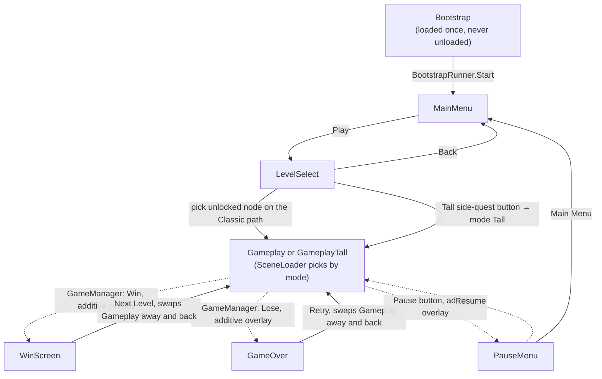
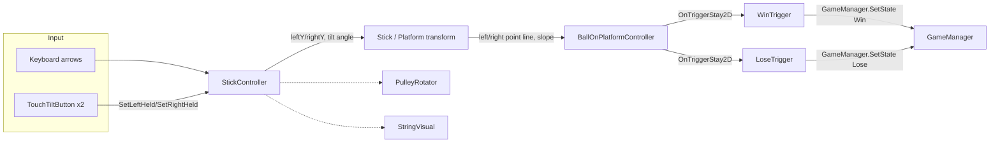

# Tilt Ball — Architecture

This document describes how the shipping game is put together. The live game lives entirely under
`Assets/Scenes/end-to-end/` — there is no other scene folder in the project. Earlier versions of this document
described `Assets/Scenes/_Archive/` and `Assets/Scenes/TiltBallScene.unity` as legacy layouts kept for reference;
both have since been deleted outright (see [Cleanup history](#cleanup-history)).

Engine: Unity `6000.3.12f1`, Universal Render Pipeline, new Input System, 2D physics.
Third-party: [PrimeTween](https://github.com/KyryloKuzyk/PrimeTween) (via OpenUPM) drives every animation in the game — no `Animator`/coroutine tweening is used.

The game ships **two modes** (§8): *Classic*, where a level fits one phone screen, and *Tall*, where the climb runs
several screens and the camera scrolls to follow it. They share every screen, script and mechanic below and differ
only in which gameplay scene loads, which level list is read, and which unlock track gates it. Level content is
described separately in `level-design.md`.

## 1. Scene graph and navigation

The game is one persistent scene plus a set of additively-swapped "screen" scenes — never a single-scene reload.
Only four scenes are ever swapped in as the **main** scene: MainMenu, LevelSelect, Gameplay, GameplayTall.
PauseMenu, WinScreen and GameOver are a different kind of scene entirely — each is loaded additively **on top of**
whichever main scene (in practice always Gameplay/GameplayTall) is still running, and none of the three carries a
`Main Camera` or `EventSystem` of its own; they rely on the scene underneath still being loaded and rendering.

**`SceneLoader`** (in Bootstrap) is the *only* script allowed to call `SceneManager` APIs — every button handler
routes through `SceneLoader.Instance` (or, for pause/win/lose, through `GameManager`; see below) instead. Its
`SwapTo(name)` unloads whatever main scene is currently up and loads the new one additively, so Bootstrap (and
anything else additive) is never touched. It backs the four calls callers actually reach for — `GoToMainMenu()`,
`GoToLevelSelect()`, `LoadGameplay()` and `RetryLevel()` — the last two routed through `ActiveGameplayScene()` so
they pick Gameplay or GameplayTall by `GameManager.CurrentMode` without the caller knowing a second mode exists.

`PauseMenu`, `WinScreen` and `GameOver` are the exceptions to the swap model, and all follow the same pattern:
loaded additively over whatever's still running rather than swapped in as a main scene of its own.
`WinScreenController` and `GameOverController` bind their `Canvas` to `Camera.main` in `Awake` (there's no camera
of their own to bind to) and fade in a translucent `CanvasGroup` backdrop over the still-visible level rather than
clearing to a blank camera — a second Base camera stacked on top runs into URP's camera-stacking rules, where
"Don't Clear" isn't a reliable see-through the way it was in the built-in pipeline. Gameplay itself is **not**
unloaded when Win/Lose fires: `SceneLoader` tracks the open result scene in `resultScreenScene` and only unloads it
(and swaps Gameplay away) once the player actually leaves — `WinScreenController.NextLevel`,
`GameOverController.Retry`, or backing out to the main menu/level select all call `UnloadResultScreenIfAny()`
before loading whatever's next.

Pause is driven through `GameManager`, the same way Win/Lose are: `GameplayHUD`'s pause button calls
`GameManager.SetState(GameState.Pause)`; `SceneLoader.HandleStateChanged` reacts to that (and to a transition
back to `GameState.Playing`, which every way of leaving Pause sets) by loading/unloading the PauseMenu scene
additively and toggling `Time.timeScale`. `GameManager` itself never touches scenes or timescale — it only holds
state and fires `OnStateChanged`; `SceneLoader` is still the sole place scene/timescale mechanics happen.

Only the four main scenes are self-contained in the classic sense: each has its own `Main Camera`, `EventSystem`,
`Canvas`, and one small controller script that wires up that scene's buttons.

Which gameplay scene loads is decided in one place — `SceneLoader.ActiveGameplayScene()`, consulted by both
`LoadGameplay()` and `RetryLevel()`. Because every navigation path already went through those two methods, picking
a level, Next Level and Retry all follow the current mode without any of them knowing a second mode exists. The
pause menu no longer has a restart/retry button of its own (see [Cleanup history](#cleanup-history)) — its only
two buttons are Resume and Main Menu.

## 2. Bootstrap and the persistent singletons

`Bootstrap.unity` is listed first in Build Settings and holds five root objects, each a classic
`Instance`-guarded MonoBehaviour singleton (`Awake` destroys any duplicate):

| Script | Responsibility |
|---|---|
| `AudioManager` | One looping `AudioSource` for music, one one-shot source for SFX, so SFX never interrupts music. Also owns menu-click sound, win/lose ducking (below), and the persisted music/SFX on-off toggles (§6). |
| `SceneLoader` | Owns all scene transitions (§1), the pause/win/lose overlays, and the mode→gameplay-scene choice. |
| `GameManager` | Tracks `CurrentState` (`Playing/Win/Lose/Pause`), `CurrentMode` (`Classic/Tall`), the selected `currentLevel`, both level lists (`allLevels`/`tallLevels`), and fires `OnStateChanged`. Holds no obstacle/geometry knowledge, and never touches scenes or `Time.timeScale` itself — purely run state. |
| `SaveManager` | Persists one unlock index **per mode** via `PlayerPrefs`; each monotonically increasing. |
| `BootstrapRunner` | The handoff: in `Start()` (guaranteed to run after every other object's `Awake`) calls `SceneLoader.Instance.GoToMainMenu()`. |

`SceneLoader` subscribes to `GameManager.OnStateChanged` in its own `Start()` and reacts to `Win`/`Lose` by
layering WinScreen/GameOver over the running gameplay scene (§1) — this is the one place gameplay outcome and
scene navigation are connected.

`AudioManager` subscribes to the same event to know when a run returns to `Playing` (Retry and Next Level both
set that state before loading their next scene), which is its cue to fade the music back up. The four outcome
sounds (`winHole`, `winScreen`, `loseHole`, `loseScreen`) are triggered directly by the scripts that need them —
`WinTrigger`/`LoseTrigger` call `PlayWinHole`/`PlayLoseHole` as the ball starts falling in, `WinScreenController`/
`GameOverController` call `PlayWinScreen`/`PlayLoseScreen` from their own `Start()` — rather than through the
state-change subscription, since by the time a `Win`/`Lose` state actually lands the ball has already fallen. The
two hole sounds also duck the music (down over `duckDuration`, back up over `restoreDuration`, both driven by
PrimeTween on unscaled time so the pause menu's `Time.timeScale = 0` can't stall a fade partway); the screen
sounds land once the theme is already ducked. Every menu button in the game — level nodes, the Tall side-quest
button, pause/resume/main-menu, retry, next level, back, and the settings/audio-toggle buttons alike — calls the
static `AudioManager.PlayClick()`; the tilt controls, which are held rather than clicked, deliberately don't.

A static-utility sixth piece, **`PerformanceSettings`**, runs via
`[RuntimeInitializeOnLoadMethod(BeforeSceneLoad)]` before Bootstrap even loads: it pins `targetFrameRate = 60`,
disables vSync, and matches `Time.fixedDeltaTime` to 60 Hz. This exists because iOS caps frame rate at 30fps
unless `targetFrameRate` is set explicitly.

### A load-bearing project setting

**Enter Play Mode Options are enabled with both domain reload and scene reload disabled**
(`ProjectSettings/EditorSettings.asset: m_EnterPlayModeOptions: 3`). This is why `BallOnPlatformController`
re-applies its kinematic-body setup every `FixedUpdate` (driven off the `Rigidbody2D`'s own state) rather than
once in `Awake` — as an `[ExecuteAlways]` component it's already "awake" from Edit mode, and `Awake` never fires
again when Play mode starts without a domain reload. (The former other example here, a static-field reset on the
now-removed `LevelLoader`, no longer applies — see [Cleanup history](#cleanup-history).)

## 3. Level system

`LevelConfig` (`ScriptableObject`, `Assets/Levels/Configs/`) holds `levelId`, `levelIndex`, and an
`obstaclesPrefab`, plus three fields that describe a tall level's climb (§8): `climbHeight`, `levelFloorY` and
`ceilingPadding`.
`ballStartPosition`, `winningHolePosition` and `timeLimit` are placeholder fields — not read by anything, since
ball/hole placement and timing stay scene-authored in both modes. Twenty configs exist — `Level_01`…`Level_18`
for Classic, `Tall_01`/`Tall_02` for Tall.

`climbHeight` defaults to `0`, which means *leave the scene's own `StickController.maxOffset` alone*. That's what
makes every pre-existing Classic config work untouched: they simply don't carry the field, so they read as 0 and
the geometry pass below early-outs.

Flow: `LevelSelectController` (in the LevelSelect scene) procedurally builds a single vertical **scrolling path**
for the Classic list (`GameManager.allLevels`) — one node per level, level 1 at the bottom, connected by a lit
trail whose reached/locked segments are colored from `SaveManager.HighestUnlocked(Classic)`; the node the player is
actually up to gets a glow behind it, and the scroll view opens already centered on it rather than at level 1.
Locked nodes render dimmed and are non-interactable. Tapping an unlocked node sets `GameManager.currentLevel`,
explicitly calls `GameManager.SetMode(GameMode.Classic)` (LevelSelect no longer assumes a mode was chosen before
it loaded — see §5), and calls `SceneLoader.LoadGameplay()`. **Tall doesn't appear on the path at all** — see §5's
"side quest" button, which sets `GameMode.Tall` and jumps straight into whichever Tall level `SaveManager` has
already unlocked, with no per-level picker of its own. In whichever gameplay scene loads, **`LevelController`**
reads `GameManager.currentLevel` in `Awake`, applies the climb geometry, then instantiates its `obstaclesPrefab`
under an `ObstaclesRoot` transform. On win, `WinScreenController` advances to `CurrentLevels[index + 1]` (looping
back to level 0 at the end) and calls `SaveManager.UnlockLevel(nextIndex)` before loading gameplay again — so
finishing a Tall level leads to the next Tall level, not back into Classic.

Obstacle prefabs live in `Assets/Levels/ObstaclePrefabs/` (`Level_02_Obstacles.prefab` … `Level_18_Obstacles.prefab`,
plus `Tall_01_Obstacles.prefab`/`Tall_02_Obstacles.prefab`); Level 1 has none, matching the `obstaclesPrefab == null`
early-out in `LevelController`. Levels 2–10 and Tall 01 are built from lose holes only; 11–18 and Tall 02 use the
obstacle/booster set described in §4a and, from a design standpoint, in `level-design.md`.

## 4. Gameplay mechanics

**`StickController`** owns the tiltable platform. Each end (`leftY`/`rightY`) rises/falls independently at
`riseSpeed`/`fallSpeed` toward `held` input, clamped to `[minOffset, maxOffset]`; tilt angle is derived *linearly*
from the height difference (not `atan2`, so turn rate stays constant even near vertical) and clamped to
`maxTiltAngle`. Input is `keyboard-arrow-keys OR touch`: `leftHeld = keyLeft || touchLeftHeld`, letting keyboard
(dev/editor) and touch coexist without either overwriting the other.

**`BallOnPlatformController`** deliberately does **not** let Unity's Rigidbody2D solver handle the ball resting
on the platform — it explicitly `Physics2D.IgnoreCollision`s the ball against every platform collider and drives
the ball's position itself: a 1-DOF simulation along the `leftPoint`–`rightPoint` line
(`v += slope * rollAcceleration * platformLength * dt`, exponential damping via a half-life, end-stop bounce),
ported 1:1 from an HTML prototype the game is based on. The ball is `Rigidbody2D.Kinematic` with gravity off;
Unity physics only re-enters the picture for the trigger colliders on the win/lose holes.

**Win/Lose** are structurally identical `OnTriggerStay2D` checks that both play the same three-part PrimeTween
fall-in sequence (pull to hole center, spin, shrink) before reporting to `GameManager`, and both fire their
`AudioManager` hole sound (§2) the instant the ball is judged sufficiently contained, so the sound lands with the
fall rather than the screen transition a beat later. They differ in how "contained enough" is measured:
- `WinTrigger` (on `WinningHole.prefab`) assumes a circular hole and just compares ball-to-hole-center distance
  against the fill sprite's radius (default containment: half in).
- `LoseTrigger` (on the 20 `LoseHole_N.prefab` variants) samples points around the ball's rim against the hole's
  actual `Collider2D` shape, since these holes are irregular blobs a single radius would describe badly (default
  containment: fully in).

Both resolve their `stick`/`gameManager` references via `FindFirstObjectByType` when left unwired, so either
prefab can be dropped into a new level's obstacle prefab without hand-wiring.

**Purely cosmetic followers**, none of which write back to gameplay state: `PulleyRotator` (spins a pulley wheel
to match `StickController`'s current held/speed state), `StringVisual` (`LineRenderer` between two anchor
transforms), `HoleOutline` (traces a `LineRenderer` around a hole's own collider so its capture boundary is
visible), `BackgroundFitter` (stretches one shared background sprite to exactly fill whatever camera it's given,
so `Background.prefab` works unmodified across every level's camera), and `MrBallIdle` (breathing/arm-sway idle
loop + procedural shadow for the mascot).

`BackgroundFitter` re-centres on the camera every `LateUpdate`, which in a Tall level means the background tracks
the scroll and so reads as static during the climb. The pulleys drawing closer and the holes passing by carry the
sense of ascent instead; if that ever stops being enough, the fix is to disable the component in the tall scene
and scale one sprite to the whole column. It also re-fits automatically whenever `CameraAspectFit` (below) grows
a camera's `orthographicSize` on a narrow device, since it reads the camera's current size/aspect live rather than
caching it once.

### 4a. Obstacles and boosters

Every obstacle acts on the ball through a small **external-influence API** on `BallOnPlatformController`, so the
1-DOF simulation stays the only thing that ever moves the ball:

| Call | Effect | Used by |
|---|---|---|
| `AddImpulse(dv)` / `SetVelocity(v)` | instant change of along-platform velocity | `BumperObstacle`, `BallShield` knock-back |
| `AddAcceleration(a)` | along-platform acceleration for the *current* physics step (accumulated, cleared after integration) | `WindZone`, `MagnetObstacle` |
| `RegisterSurface(key, accelMul, dampingMul)` / `UnregisterSurface` | multiplies roll acceleration and damping half-life while registered | `IcePatch` |
| `SignedOffsetAlong(point)` / `Tangent` | where a world point sits relative to the ball along the stick (−left / +right) | everything that needs a direction |

Because the ball is kinematic with `useFullKinematicContacts`, all of these are ordinary trigger colliders on
the obstacle — the same channel the holes already use. The scripts live in `Assets/Scripts/Gameplay/Obstacles/`
and `…/Boosters/`, the prefabs in `Assets/Prefabs/Obstacles/`:

- **`BumperObstacle`** — `SetVelocity` away from its centre on contact, with a cooldown and a squash tween.
- **`WindZone`** — constant `AddAcceleration` while inside; optional gusting (`period`/`dutyCycle`/`phase`).
  `size` drives a `Layout()` that sizes the trigger, the 9-sliced band, the fan and the chevrons together.
- **`MagnetObstacle`** — `AddAcceleration` toward itself with distance falloff, reach = its `CircleCollider2D`.
- **`LaserGate`** + **`LaserBeam`** — timed on/off beam; the beam child relays its trigger to the gate, which
  calls `BallHazard.Zap`. `width` drives `Layout()`.
- **`IcePatch`** — `RegisterSurface` on enter, `UnregisterSurface` on exit (and on disable, defensively).
- **`Oscillator`** — cosmetic-free modifier that slides any transform on a sine; makes a hole "drift".
- **`Pickup`** (abstract) → **`JetBoostPickup`** (parks a `StickBoost` on the stick that scales `riseSpeed`/`fallSpeed`
  and restores the authored values when the timer ends; a second pickup extends rather than stacks) and
  **`ShieldPickup`** (adds/activates `BallShield` on the ball).
- **`BallHazard`** is the static counterpart of `LoseTrigger.FallIntoHole` for non-hole deaths: it checks the
  shield first (`TryShield`), then runs a flash-and-burst and reports `GameState.Lose` after the same
  `screenDelay` beat. `LoseTrigger` calls `BallHazard.TryShield` before swallowing the ball, and ignores the ball
  for `shieldGrace` seconds afterwards so the knock-back can carry it out.

The sprites in `Assets/Art/Obstacles/` are generated, not drawn: `Assets/Editor/ObstacleArtGenerator.cs`
(**Tools ▸ Tilt Ball ▸ Generate Obstacle Art**) rasterises flat SDF shapes in the game's palette and imports them
at 100 PPU, with 9-slice borders on the band/ice sheets. Regenerating in place keeps every prefab reference.

## 5. UI layer

Each screen scene has one thin controller (`MainMenuFlow`, `LevelSelectController`, `PauseController`,
`GameOverController`, `WinScreenController`, `GameplayHUD`) whose only job is wiring `Button.onClick` to
`SceneLoader`/`GameManager`/`SaveManager` calls — no scene ever calls `SceneManager` directly.

Two shared utilities back every screen:
- **`ScreenEntranceAnimator`** — a static PrimeTween helper for the drop-in-with-overshoot title animation and
  the pop-in-then-pulse button animation, used identically by `WinScreenController`, `GameOverController`, and
  `MainMenuFlow`. Its `AnimateTitle` takes an optional `idleAfter` flag that starts a gentle yoyo scale breathing
  loop once the drop-in lands; only `MainMenuFlow`'s title uses it, since that's the one title that stays on
  screen (WinScreen/GameOver reload out before an idle loop would read).
- **`SafeArea`** — adjusts a `RectTransform`'s anchors to `Screen.safeArea` every frame, so notches, the Dynamic
  Island, and iOS slide-over/split-view are handled live rather than once at launch.

### Responsive camera fit

**`CameraAspectFit`** (`[DefaultExecutionOrder(-1000)]`, one per gameplay/menu camera) fits that camera's world
content to the device the way a fixed-design mobile layout is meant to: the visible world **width** is held
constant on every device — `designOrthographicSize * profile.designAspect`, captured from whatever the scene's
camera was authored with — so nothing at the design's horizontal edges (the stick, the pulleys) can ever be
cropped, on any aspect ratio. Height is what's allowed to vary between devices:
- Device aspect ≥ the design's (tablets, squarer screens): `orthographicSize` stays at its authored value and the
  viewport **width** is capped to match the design aspect at full height, centered — pillarboxed sides.
- Device aspect < the design's (ordinary tall phones, and very elongated ones like a folding phone's cover
  screen): the viewport fills edge-to-edge, and `orthographicSize` grows just enough to keep the same world width
  visible — the extra room lands as vertical headroom, never as a horizontal crop.

It checks `Screen.width`/`Screen.height` every frame (cheap; the fit math only reruns on an actual change) so a
live resize — Editor window resizing, Android split-screen, a foldable's fold state — is picked up without a
scene reload. Changing `orthographicSize` only changes how much of the world the camera shows; it never rescales
any `Transform`, so `Rigidbody2D` physics (gravity, the stick's tuned speeds, rope/joint distances) stay exactly
as authored regardless of which branch is active. It also creates and owns a second `LetterboxBackdrop` camera
(solid black, `cullingMask = 0`, `depth` one below the main camera) itself, since a camera's own Clear Flags only
clear its own viewport rect — without a backdrop camera, whatever the GPU last drew would show through outside
the game's rect. **`ScreenFitProfile`** is the shared `ScriptableObject` every scene's `CameraAspectFit`
references so the letterbox behaves identically everywhere; its one field, `designAspect`, defaults to `1080/1920`
to match the project's `CanvasScaler` reference resolution. Gameplay's Canvas is expected to be Screen Space -
Camera bound to this same camera, so UI and world share the rect and can never separate on any aspect ratio.

**`PinnedToView`** (`[ExecuteAlways]`) pins an object to a fixed fraction of the camera's *current* view — `(0.5,
0.5)` is dead centre, `(0.5, 0)` bottom-centre, the same convention as a UI anchor — rather than a fixed world
position, so it doesn't drift when `CameraAspectFit` grows a camera's `orthographicSize` on a narrower device.
Since `BackgroundFitter` always stretches the background to exactly fill that same view, pinning to a view
fraction here is equivalent to pinning to a fixed spot on the background art itself.

Gameplay's pause button is `Assets/Prefabs/PauseButton.prefab` — a plain `Button`/`Image`, wired to
`GameplayHUD.pauseButton` in the inspector — sitting in front of a decorative `TopBar` image (`HUD_TopBar.png`)
on the Gameplay canvas.

### Settings and audio toggles

**`SettingsPanelController`** is a self-contained settings overlay: some button elsewhere in the scene calls
`Open()`, tapping the backdrop calls `Close()`. It's reused as-is by `MainMenuFlow.settingsButton` and
`LevelSelectController.settingsButton` — screens with no `GameState` of their own, so this is a plain `SetActive`
toggle rather than the pause menu's route through `GameManager`'s Pause state and a whole additive scene. The root
object stays active always (`Awake` needs to run to wire the backdrop); only the overlay child — backdrop plus
the toggle icons — is what's actually hidden until opened.

**`AudioToggleButton`** is one component, reused for both the music and SFX toggles (`Kind.Music`/`Kind.Sfx`): it
calls `AudioManager.Instance.ToggleMusic()`/`ToggleSfx()` and swaps its own `Image.sprite` between an on/off pair
to match `AudioManager`'s current state, refreshing both on click and on `Start()` so it always opens showing
whatever the player last set rather than a default. The pause menu places these two buttons directly, since it's
already an overlay; `MainMenuFlow`/`LevelSelectController` instead put them inside the `SettingsPanelController`
overlay described above, since neither of those screens is an overlay of its own.

### Level select and the Tall side quest

The Main Menu carries a single `PlayButton`, routed through `MainMenuFlow.Play` straight to LevelSelect — there is
no mode choice on this screen; both modes are chosen on the next one. `LevelSelectController` renders the Classic
list as a single vertical path that scrolls (§3) and additionally carries a `tallButton` fixed to the bottom-right
corner as a **side quest**, unaffected by the path's scrolling underneath it. Tapping it (`PlayTall`) sets
`GameMode.Tall`, resumes at `SaveManager.HighestUnlocked(Tall)` (clamped into range), and loads gameplay the same
way a Classic node does — there's no visible level list for Tall at all; the track simply resumes at the highest
unlocked Tall level (`Tall_01`, then `Tall_02`).

## 6. Persistence

The only persisted state is `PlayerPrefs`, all read once at `Awake` (not on demand) so nothing depends on load
order between the two managers that own it:

| State | `PlayerPrefs` key | Owner |
|---|---|---|
| Classic unlock index | `HighestUnlockedLevelIndex` | `SaveManager` |
| Tall unlock index | `Tall_HighestUnlockedLevelIndex` | `SaveManager` |
| Music enabled | `MusicEnabled` | `AudioManager` |
| SFX enabled | `SfxEnabled` | `AudioManager` |

The two unlock indices are only ever raised (finishing an earlier level again can't lock out later ones); the
Classic key is spelled exactly as it always was — renaming it would read back zero and silently reset every
existing player's progress. `SaveManager` loads both in `Awake` so it never depends on `GameManager` having woken
first, and the one-argument `IsUnlocked`/`UnlockLevel` resolve the mode themselves (falling back to Classic if
`GameManager` isn't up yet), which is why no call site had to learn about modes. Two-argument overloads exist for
addressing a specific mode's track directly.

The two audio toggles default to `true` and mute via `AudioSource.mute` rather than by zeroing volume, so they
can't collide with the win/lose duck/restore tween, which already owns the volume field.

There is no save data for timings or scores.

## 7. Build & release tooling

`Assets/Editor/IOSBuildStamper.cs` is an `IPreprocessBuildWithReport`/`IPostprocessBuildWithReport` hook, active
for iOS builds only:
- **Preprocess**: increments a persistent build number (stored in `PlayerSettings.iOS.buildNumber`) and saves
  immediately, so a failed build can't hand its number to the next attempt.
- **Postprocess**: stamps `CFBundleDisplayName` in the generated Xcode project's `Info.plist` to a short
  `"tilt <version> (<build>)"` (kept short because iOS truncates home-screen labels around 12 characters), and
  appends a per-version suffix to the iOS bundle identifier (e.g. `com.DefaultCompany.tilt-ball.v1-1`) directly
  in the generated Xcode project — `PlayerSettings` itself is never rewritten, so the suffix can't stack across
  builds. This lets different app *versions* install side-by-side on one test device.

## 8. Tall levels

A Tall level is the same rig playing out over a taller column. **The stick keeps its size and its mechanic** —
only its vertical *travel range* grows, so the climb runs several screens instead of one, and the camera scrolls
up to follow the rig. Nothing in `StickController`, `BallOnPlatformController`, `WinTrigger` or `LoseTrigger`
changed to support this; they were already written in world space with no notion of the camera. It's reached
through LevelSelect's side-quest button rather than a level list of its own — see §5.

`GameplayTall.unity` is a duplicate of `Gameplay.unity` with two differences: `CameraClimbFollow` on its
`Main Camera`, and `LevelController`'s four geometry references wired up (they stay empty in the Classic scene,
which is what keeps Classic's behaviour identical).

### Stretching the scene to the level

`LevelController.ApplyLevelGeometry()` runs in `Awake` and, for any config with `climbHeight > 0`:

1. Sets `StickController.maxOffset` to `climbHeight`.
2. Lifts the `Pulleys` group and the `WinningHole` by `rise = climbHeight - maxOffset` — *the same delta the
   summit moved*.
3. Hands the camera its bounds: floor `levelFloorY`, ceiling `stickSpawnY + climbHeight + ceilingPadding`.

Step 2 is the piece worth understanding. Rather than giving each object a per-level coordinate, everything that
belongs at the top of the climb is shifted by however much the top moved, so the rig keeps whatever proportions
the scene was authored with at any height. In the Classic scene the stick spawns at `y = -4.47` and climbs 10.5
to a summit of `6.03`, with the pulleys at `5.30` and the hole at `5.28` clustered just beneath it. `Tall_01`
asks for `climbHeight 34`, so `rise = 23.5` and those two land at `28.80` and `28.78` — still just beneath the
new summit of `29.53`.

**Only `maxOffset` is ever written on the stick.** It's re-read every `FixedUpdate`, so undefined `Awake` order
between GameObjects can't bite. The stick's position and `minOffset` are captured in `StickController.Awake`
(`baseY = rb.position.y - minOffset`) and must not be touched from outside — a future level needing a different
spawn height wants a `SetTravelRange` method on `StickController`, not a reach-in.

### The camera

`CameraClimbFollow` is ~40 lines and deliberately not Cinemachine, which isn't in `Packages/manifest.json` and
whose 2D confiner would want a per-level bounding shape.

- It follows **the stick, not the ball**: the stick's centre rises smoothly at the rig's own speed, while the
  ball's height swings as it rolls along the tilt, which would shake the camera for reasons the player didn't cause.
- `ConfigureBounds(floorY, ceilingY)` keeps the camera's centre half a view inside the level, so neither edge is
  ever on screen: `minY = floorY + orthographicSize`, `maxY = ceilingY - orthographicSize`. For `Tall_01` that's
  `[0, 23.28]`.
- **If `maxY < minY`** — a level shorter than one screen, i.e. every Classic level — both collapse to the
  midpoint and the camera simply doesn't move. That degenerate case is what lets the same component sit in a
  Classic scene harmlessly.
- `LateUpdate` `SmoothDamp`s toward the clamped target on **`Time.unscaledDeltaTime`**, because the pause menu
  sets `Time.timeScale = 0` and a glide left half-finished there would lurch the moment the player resumed. Same
  reasoning as `AudioManager`'s music fades.
- `LevelController` calls `SnapToTarget()` from `Start`, or the camera would visibly glide in from wherever the
  scene left it on the first frame.

Because `minY` works out to `0` for `Tall_01` — the same place Classic's camera sits — a Tall level opens on a
frame identical to Classic's and only starts scrolling once the player has climbed above it. At the other end the
camera parks at `maxY` while the stick rises through the upper part of the frame, so the last screenful plays
exactly like a Classic level: arriving at the summit.

## Cleanup history

The following dead code was identified while writing earlier versions of this document (confirmed unused by GUID,
not just by name) and has since been removed:

- **`LevelLoader`** — duplicated `LevelController`'s obstacle-spawning job with its own, disconnected progression
  system. It was referenced only by `Assets/Scenes/TiltBallScene.unity` and `Assets/Scenes/_Archive/Level.unity`.
  Both of those archived scenes, along with the rest of `_Archive/`, have since been deleted from the project
  entirely — they no longer exist on disk at all.
- **`TouchTiltControls`** — an unreferenced alternate implementation of touch tilt input; `TouchControls.prefab`
  uses `TouchTiltButton` instead.
- **`Assets/Physics/BouncyBall.physicsMaterial2D`** — unreferenced by any prefab, scene, or asset.
- **Level 11** — the `lvl11` `LevelConfig` and its mangled-named `Level_!1.prefab` obstacle prefab are gone; the
  game shipped ten Classic levels at the time, `Level_01`…`Level_10`; 11–18 were added later with the obstacle set (§4a).
- **MainMenu's mode picker** — `MainMenuFlow` used to carry a `TallButton` next to `PlayButton`, both routed
  through a `StartMode` method that set the mode before handing off to LevelSelect. Neither the button nor the
  method exists anymore: MainMenu now has one `PlayButton`, and LevelSelect decides the mode itself (§3, §5) via
  its Classic path nodes or its Tall side-quest button. The `Button_Continue.png`-with-blue-tint placeholder art
  this used to note is gone too — LevelSelect's Tall entry point now has dedicated art
  (`Assets/Art/UI/LevelSelect/LevelNode_Tall.png`).
- **Pause menu's restart button** — `PauseController` now wires only Resume and Main Menu; retrying a level from
  inside a run happens via Game Over's Retry button instead.

`GameState.Pause` was briefly removed in an earlier pass (it was unused at the time) and then reinstated once
pausing was rerouted through `GameManager` — see §2.
