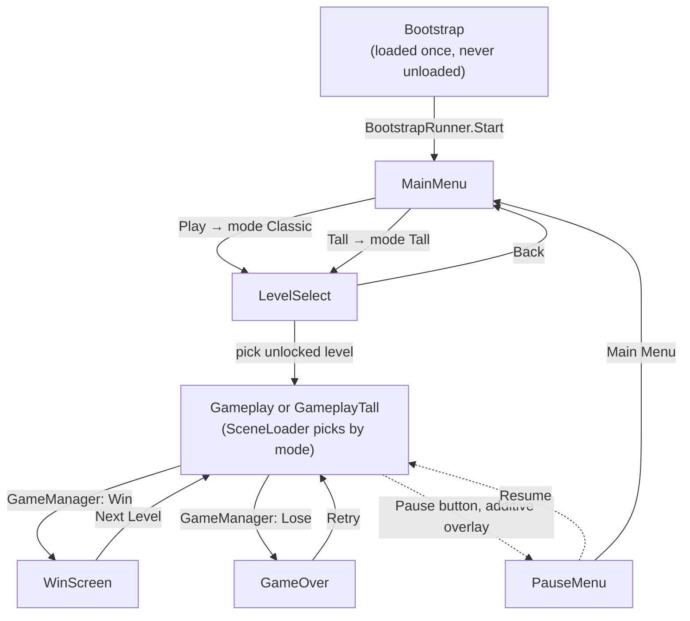
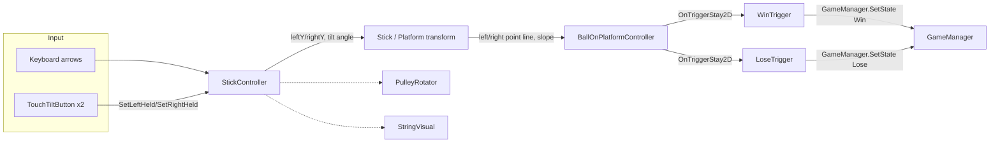

# Tilt Ball — Architecture

This document describes how the shipping game is put together. The live game lives entirely under
`Assets/Scenes/end-to-end/`; `Assets/Scenes/_Archive/` and `Assets/Scenes/TiltBallScene.unity` are earlier
layouts kept for reference and are **not** part of the current architecture (see [Cleanup history](#cleanup-history)).

Engine: Unity `6000.3.12f1`, Universal Render Pipeline, new Input System, 2D physics.
Third-party: [PrimeTween](https://github.com/KyryloKuzyk/PrimeTween) (via OpenUPM) drives every animation in the game — no `Animator`/coroutine tweening is used.

The game ships **two modes** (§8): *Classic*, where a level fits one phone screen, and *Tall*, where the climb runs
several screens and the camera scrolls to follow it. They share every screen, script and mechanic below and differ
only in which gameplay scene loads, which level list is read, and which unlock track gates it.

## 1. Scene graph and navigation

The game is one persistent scene plus a set of additively-swapped "screen" scenes — never a single-scene reload.

**`SceneLoader`** (in Bootstrap) is the *only* script allowed to call `SceneManager` APIs — every button handler
routes through `SceneLoader.Instance` (or, for pause, through `GameManager`; see below) instead. Its
`SwapTo(name)` unloads whatever "main" scene is currently up and loads the new one additively, so Bootstrap (and
anything else additive) is never touched. `PauseMenu` is the one exception to the swap model: it's loaded
*additively on top of* the gameplay scene rather than swapped in as a main scene — which is also why the PauseMenu
scene has no `Main Camera`/`EventSystem` of its own; it relies on the gameplay scene's still being loaded
underneath it.

Pause is driven through `GameManager`, the same way Win/Lose are: `GameplayHUD`'s pause button calls
`GameManager.SetState(GameState.Pause)`; `SceneLoader.HandleStateChanged` reacts to that (and to a transition
back to `GameState.Playing`) by loading/unloading the PauseMenu scene additively and toggling `Time.timeScale`.
`GameManager` itself never touches scenes or timescale — it only holds state and fires `OnStateChanged`;
`SceneLoader` is still the sole place scene/timescale mechanics happen.

Each of the six "main" scenes (MainMenu, LevelSelect, Gameplay, GameplayTall, WinScreen, GameOver) is
self-contained: its own `Main Camera`, `EventSystem`, `Canvas`, and one small controller script that wires up that
scene's buttons.

Which gameplay scene loads is decided in one place — `SceneLoader.ActiveGameplayScene()`, consulted by both
`LoadGameplay()` and `RetryLevel()`. Because every navigation path already went through those two methods, picking
a level, Next Level, Retry and the pause menu's Restart all follow the current mode without any of them knowing a
second mode exists.

## 2. Bootstrap and the persistent singletons

`Bootstrap.unity` is listed first in Build Settings and holds five root objects, each a classic
`Instance`-guarded MonoBehaviour singleton (`Awake` destroys any duplicate):

| Script | Responsibility |
|---|---|
| `AudioManager` | One looping `AudioSource` for music, one one-shot source for SFX, so SFX never interrupts music. Also owns menu-click sound and win/lose ducking (below). |
| `SceneLoader` | Owns all scene transitions (§1), the pause overlay, and the mode→gameplay-scene choice. |
| `GameManager` | Tracks `CurrentState` (`Playing/Win/Lose/Pause`), `CurrentMode` (`Classic/Tall`), the selected `currentLevel`, both level lists (`allLevels`/`tallLevels`), and fires `OnStateChanged`. Holds no obstacle/geometry knowledge, and never touches scenes or `Time.timeScale` itself — purely run state. |
| `SaveManager` | Persists one unlock index **per mode** via `PlayerPrefs`; each monotonically increasing. |
| `BootstrapRunner` | The handoff: in `Start()` (guaranteed to run after every other object's `Awake`) calls `SceneLoader.Instance.GoToMainMenu()`. |

`SceneLoader` subscribes to `GameManager.OnStateChanged` in its own `Start()` and reacts to `Win`/`Lose` by
swapping to WinScreen/GameOver — this is the one place gameplay outcome and scene navigation are connected.

`AudioManager` subscribes to the same event to know when a run returns to `Playing` (Retry and Next Level both
set that state before loading their next scene), which is its cue to fade the music back up. The four outcome
sounds (`winHole`, `winScreen`, `loseHole`, `loseScreen`) are triggered directly by the scripts that need them —
`WinTrigger`/`LoseTrigger` call `PlayWinHole`/`PlayLoseHole` as the ball starts falling in, `WinScreenController`/
`GameOverController` call `PlayWinScreen`/`PlayLoseScreen` from their own `Start()` — rather than through the
state-change subscription, since by the time a `Win`/`Lose` state actually lands the ball has already fallen. The
two hole sounds also duck the music (down over `duckDuration`, back up over `restoreDuration`, both driven by
PrimeTween on unscaled time so the pause menu's `Time.timeScale = 0` can't stall a fade partway); the screen
sounds land once the theme is already ducked. Every menu button in the game (Play, level buttons, pause/resume/
restart/main-menu, retry, next level, back) calls the static `AudioManager.PlayClick()` — the tilt controls,
which are held rather than clicked, deliberately don't.

A static-utility sixth piece, **`PerformanceSettings`**, runs via
`[RuntimeInitializeOnLoadMethod(BeforeSceneLoad)]` before Bootstrap even loads: it pins `targetFrameRate = 60`,
disables vSync, and matches `Time.fixedDeltaTime` to 60 Hz. This exists because iOS caps frame rate at 30fps
unless `targetFrameRate` is set explicitly.

### A load-bearing project setting

**Enter Play Mode Options are enabled with both domain reload and scene reload disabled**
(`ProjectSettings/EditorSettings.asset: m_EnterPlayModeOptions: 3`). This is why `BallOnPlatformController`
re-applies its kinematic-body setup every `FixedUpdate` (driven off the `Rigidbody2D`'s own state) rather than
once in `Awake` — as an `[ExecuteAlways]` component it's already "awake" from Edit mode, and `Awake` never fires
again when Play mode starts without a domain reload. (The former other example here, a static-field reset on the
now-removed `LevelLoader`, no longer applies — see [Cleanup history](#cleanup-history).)

## 3. Level system

`LevelConfig` (`ScriptableObject`, `Assets/Levels/Configs/`) holds `levelId`, `levelIndex`, and an
`obstaclesPrefab`, plus three fields that describe a tall level's climb (§8): `climbHeight`, `levelFloorY` and
`ceilingPadding`. Twelve configs exist — `Level_01`…`Level_10` and `lvl11` for Classic, `Tall_01` for Tall.
`ballStartPosition`, `winningHolePosition` and `timeLimit` are placeholder fields — not read by anything, since
ball/hole placement and timing stay scene-authored in both modes.

`climbHeight` defaults to `0`, which means *leave the scene's own `StickController.maxOffset` alone*. That's what
makes every pre-existing Classic config work untouched: they simply don't carry the field, so they read as 0 and
the geometry pass below early-outs.

Flow: `LevelSelectController` (in the LevelSelect scene) builds one button per entry in
`GameManager.CurrentLevels` — the active mode's list — disabling any beyond `SaveManager.IsUnlocked(index)`.
Picking one sets `GameManager.currentLevel` and calls `SceneLoader.LoadGameplay()`. In whichever gameplay scene
loads, **`LevelController`** reads `GameManager.currentLevel` in `Awake`, applies the climb geometry, then
instantiates its `obstaclesPrefab` under an `ObstaclesRoot` transform. On win, `WinScreenController` advances to
`CurrentLevels[index + 1]` (looping back to level 0 at the end) and calls `SaveManager.UnlockLevel(nextIndex)`
before loading gameplay again — so finishing a Tall level leads to the next Tall level, not back into Classic.

Obstacle prefabs live in `Assets/Levels/ObstaclePrefabs/` (`Level_02_Obstacles.prefab` … `Level_10_Obstacles.prefab`,
plus one for level 11 whose asset name got mangled to `Level_!1.prefab`, and `Tall_01_Obstacles.prefab`); Level 1
has none, matching the `obstaclesPrefab == null` early-out in `LevelController`.

## 4. Gameplay mechanics

**`StickController`** owns the tiltable platform. Each end (`leftY`/`rightY`) rises/falls independently at
`riseSpeed`/`fallSpeed` toward `held` input, clamped to `[minOffset, maxOffset]`; tilt angle is derived *linearly*
from the height difference (not `atan2`, so turn rate stays constant even near vertical) and clamped to
`maxTiltAngle`. Input is `keyboard-arrow-keys OR touch`: `leftHeld = keyLeft || touchLeftHeld`, letting keyboard
(dev/editor) and touch coexist without either overwriting the other.

**`BallOnPlatformController`** deliberately does **not** let Unity's Rigidbody2D solver handle the ball resting
on the platform — it explicitly `Physics2D.IgnoreCollision`s the ball against every platform collider and drives
the ball's position itself: a 1-DOF simulation along the `leftPoint`–`rightPoint` line
(`v += slope * rollAcceleration * platformLength * dt`, exponential damping via a half-life, end-stop bounce),
ported 1:1 from an HTML prototype the game is based on. The ball is `Rigidbody2D.Kinematic` with gravity off;
Unity physics only re-enters the picture for the trigger colliders on the win/lose holes.

**Win/Lose** are structurally identical `OnTriggerStay2D` checks that both play the same three-part PrimeTween
fall-in sequence (pull to hole center, spin, shrink) before reporting to `GameManager`, and both fire their
`AudioManager` hole sound (§2) the instant the ball is judged sufficiently contained, so the sound lands with the
fall rather than the screen transition a beat later. They differ in how "contained enough" is measured:
- `WinTrigger` (on `WinningHole.prefab`) assumes a circular hole and just compares ball-to-hole-center distance
  against the fill sprite's radius (default containment: half in).
- `LoseTrigger` (on the 20 `LoseHole_N.prefab` variants) samples points around the ball's rim against the hole's
  actual `Collider2D` shape, since these holes are irregular blobs a single radius would describe badly (default
  containment: fully in).

Both resolve their `stick`/`gameManager` references via `FindFirstObjectByType` when left unwired, so either
prefab can be dropped into a new level's obstacle prefab without hand-wiring.

**Purely cosmetic followers**, none of which write back to gameplay state: `PulleyRotator` (spins a pulley wheel
to match `StickController`'s current held/speed state), `StringVisual` (`LineRenderer` between two anchor
transforms), `HoleOutline` (traces a `LineRenderer` around a hole's own collider so its capture boundary is
visible), `BackgroundFitter` (stretches one shared background sprite to exactly fill whatever camera it's given,
so `Background.prefab` works unmodified across every level's camera), and `MrBallIdle` (breathing/arm-sway idle
loop + procedural shadow for the mascot).

`BackgroundFitter` re-centres on the camera every `LateUpdate`, which in a Tall level means the background tracks
the scroll and so reads as static during the climb. The pulleys drawing closer and the holes passing by carry the
sense of ascent instead; if that ever stops being enough, the fix is to disable the component in the tall scene
and scale one sprite to the whole column.

## 5. UI layer

Each screen scene has one thin controller (`MainMenuFlow`, `LevelSelectController`, `PauseController`,
`GameOverController`, `WinScreenController`, `GameplayHUD`) whose only job is wiring `Button.onClick` to
`SceneLoader`/`GameManager`/`SaveManager` calls — no scene ever calls `SceneManager` directly.

Two shared utilities back every screen:
- **`ScreenEntranceAnimator`** — a static PrimeTween helper for the drop-in-with-overshoot title animation and
  the pop-in-then-pulse button animation, used identically by `WinScreenController`, `GameOverController`, and
  `MainMenuFlow`. Its `AnimateTitle` takes an optional `idleAfter` flag that starts a gentle yoyo scale breathing
  loop once the drop-in lands; only `MainMenuFlow`'s title uses it, since that's the one title that stays on
  screen (WinScreen/GameOver reload out before an idle loop would read).
- **`SafeArea`** — adjusts a `RectTransform`'s anchors to `Screen.safeArea` every frame, so notches, the Dynamic
  Island, and iOS slide-over/split-view are handled live rather than once at launch.

Gameplay's pause button is `Assets/Prefabs/PauseButton.prefab` — a plain `Button`/`Image`, wired to
`GameplayHUD.pauseButton` in the inspector — sitting in front of a decorative `TopBar` image (`HUD_TopBar.png`)
on the Gameplay canvas. `Assets/Art/Settings_Button.png` was added alongside it but isn't placed in any scene or
referenced by any script yet — there is no settings menu.

The Main Menu carries two buttons, `PlayButton` and `TallButton`, both routed through `MainMenuFlow.StartMode`,
which sets the mode and then goes to LevelSelect. **`TallButton` is still placeholder art**: it reuses
`Button_Continue.png` with a blue tint purely so the two are told apart, since no artwork for a second mode exists
yet.

## 6. Persistence

The only persisted state is two integers, one unlock index per mode, each stored in `PlayerPrefs` and only ever
raised (finishing an earlier level again can't lock out later ones):

| Mode | `PlayerPrefs` key |
|---|---|
| Classic | `HighestUnlockedLevelIndex` |
| Tall | `Tall_HighestUnlockedLevelIndex` |

Classic's key is spelled exactly as it always was — renaming it would read back zero and silently reset every
existing player's progress. `SaveManager` loads both in `Awake` so it never depends on `GameManager` having woken
first, and the one-argument `IsUnlocked`/`UnlockLevel` resolve the mode themselves (falling back to Classic if
`GameManager` isn't up yet), which is why no call site had to learn about modes. Two-argument overloads exist for
addressing a specific mode's track directly.

There is no save data for settings, timings, or scores.

## 7. Build & release tooling

`Assets/Editor/IOSBuildStamper.cs` is an `IPreprocessBuildWithReport`/`IPostprocessBuildWithReport` hook, active
for iOS builds only:
- **Preprocess**: increments a persistent build number (stored in `PlayerSettings.iOS.buildNumber`) and saves
  immediately, so a failed build can't hand its number to the next attempt.
- **Postprocess**: stamps `CFBundleDisplayName` in the generated Xcode project's `Info.plist` to a short
  `"tilt <version> (<build>)"` (kept short because iOS truncates home-screen labels around 12 characters), and
  appends a per-version suffix to the iOS bundle identifier (e.g. `com.DefaultCompany.tilt-ball.v1-1`) directly
  in the generated Xcode project — `PlayerSettings` itself is never rewritten, so the suffix can't stack across
  builds. This lets different app *versions* install side-by-side on one test device.

## 8. Tall levels

A Tall level is the same rig playing out over a taller column. **The stick keeps its size and its mechanic** —
only its vertical *travel range* grows, so the climb runs several screens instead of one, and the camera scrolls
up to follow the rig. Nothing in `StickController`, `BallOnPlatformController`, `WinTrigger` or `LoseTrigger`
changed to support this; they were already written in world space with no notion of the camera.

`GameplayTall.unity` is a duplicate of `Gameplay.unity` with two differences: `CameraClimbFollow` on its
`Main Camera`, and `LevelController`'s four geometry references wired up (they stay empty in the Classic scene,
which is what keeps Classic's behaviour identical).

### Stretching the scene to the level

`LevelController.ApplyLevelGeometry()` runs in `Awake` and, for any config with `climbHeight > 0`:

1. Sets `StickController.maxOffset` to `climbHeight`.
2. Lifts the `Pulleys` group and the `WinningHole` by `rise = climbHeight - maxOffset` — *the same delta the
   summit moved*.
3. Hands the camera its bounds: floor `levelFloorY`, ceiling `stickSpawnY + climbHeight + ceilingPadding`.

Step 2 is the piece worth understanding. Rather than giving each object a per-level coordinate, everything that
belongs at the top of the climb is shifted by however much the top moved, so the rig keeps whatever proportions
the scene was authored with at any height. In the Classic scene the stick spawns at `y = -4.47` and climbs 10.5
to a summit of `6.03`, with the pulleys at `5.30` and the hole at `5.28` clustered just beneath it. `Tall_01`
asks for `climbHeight 34`, so `rise = 23.5` and those two land at `28.80` and `28.78` — still just beneath the
new summit of `29.53`.

**Only `maxOffset` is ever written on the stick.** It's re-read every `FixedUpdate`, so undefined `Awake` order
between GameObjects can't bite. The stick's position and `minOffset` are captured in `StickController.Awake`
(`baseY = rb.position.y - minOffset`) and must not be touched from outside — a future level needing a different
spawn height wants a `SetTravelRange` method on `StickController`, not a reach-in.

### The camera

`CameraClimbFollow` is ~40 lines and deliberately not Cinemachine, which isn't in `Packages/manifest.json` and
whose 2D confiner would want a per-level bounding shape.

- It follows **the stick, not the ball**: the stick's centre rises smoothly at the rig's own speed, while the
  ball's height swings as it rolls along the tilt, which would shake the camera for reasons the player didn't cause.
- `ConfigureBounds(floorY, ceilingY)` keeps the camera's centre half a view inside the level, so neither edge is
  ever on screen: `minY = floorY + orthographicSize`, `maxY = ceilingY - orthographicSize`. For `Tall_01` that's
  `[0, 23.28]`.
- **If `maxY < minY`** — a level shorter than one screen, i.e. every Classic level — both collapse to the
  midpoint and the camera simply doesn't move. That degenerate case is what lets the same component sit in a
  Classic scene harmlessly.
- `LateUpdate` `SmoothDamp`s toward the clamped target on **`Time.unscaledDeltaTime`**, because the pause menu
  sets `Time.timeScale = 0` and a glide left half-finished there would lurch the moment the player resumed. Same
  reasoning as `AudioManager`'s music fades.
- `LevelController` calls `SnapToTarget()` from `Start`, or the camera would visibly glide in from wherever the
  scene left it on the first frame.

Because `minY` works out to `0` for `Tall_01` — the same place Classic's camera sits — a Tall level opens on a
frame identical to Classic's and only starts scrolling once the player has climbed above it. At the other end the
camera parks at `maxY` while the stick rises through the upper part of the frame, so the last screenful plays
exactly like a Classic level: arriving at the summit.

## Cleanup history

The following dead code was identified while writing this document (confirmed unused by GUID, not just by name)
and has since been removed:

- **`LevelLoader`** — duplicated `LevelController`'s obstacle-spawning job with its own, disconnected progression
  system. It was referenced only by `Assets/Scenes/TiltBallScene.unity` and `Assets/Scenes/_Archive/Level.unity`,
  both outside `Scenes/end-to-end/`. Those two archived scenes now show a missing-script warning on that
  component if opened in the editor — expected, since they're legacy layouts, not the shipping game.
- **`TouchTiltControls`** — an unreferenced alternate implementation of touch tilt input; `TouchControls.prefab`
  uses `TouchTiltButton` instead.
- **`Assets/Physics/BouncyBall.physicsMaterial2D`** — unreferenced by any prefab, scene, or asset.

`GameState.Pause` was briefly removed in this same pass (it was unused at the time) and then reinstated once
pausing was rerouted through `GameManager` — see §2.
